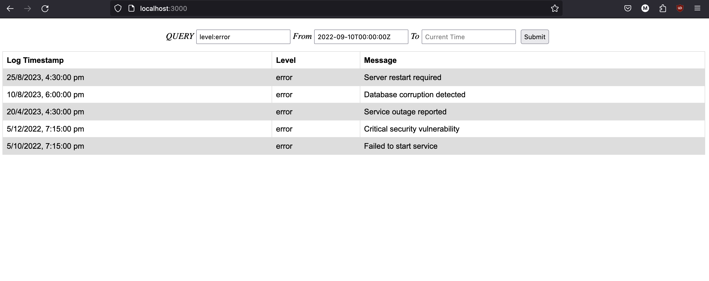
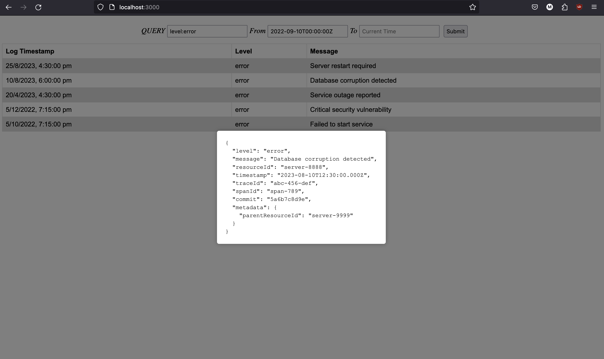
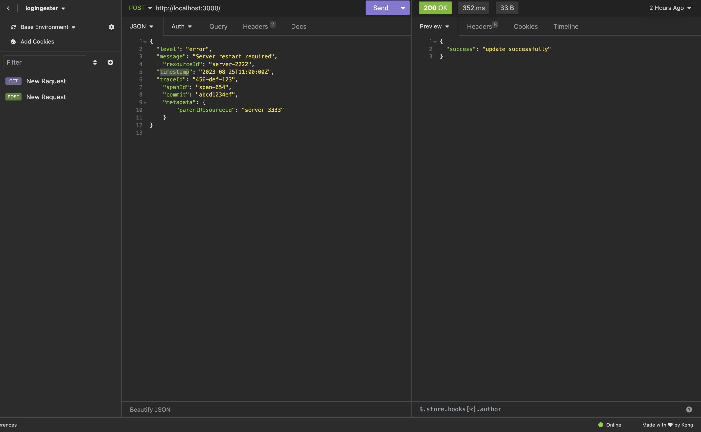
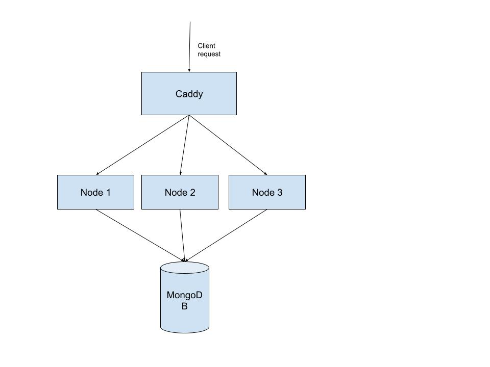

<h1 align="center">Log Ingester</h1>

It is a log ingester that can efficiently handle log data, and offer a simple web interface for querying this data using full-text search or specific field filters.

</br>
<details>
  <summary>Table of Contents</summary>
  <ol>
    <li>
      <a href="#about-the-project">About The Project</a>
      <ul>
        <li><a href="#built-with">Built With</a></li>
      </ul>
    </li>
    <li>
      <a href="#getting-started">Getting Started</a>
      <ul>
        <li><a href="#prerequisites">Prerequisites</a></li>
        <li><a href="#installation">Installation</a></li>
      </ul>
    </li>
    <li><a href="#Example">Examples</a></li>
  </ol>
</details>


## About The Project




- It is Basic log ingester and Log query interface project utilize basic crud operations.


### Built With


* [![Express][Express.js]][Express-url]
* [![Node][Node.js]][Node-url]
* [![Caddy][Caddy-img]][Caddy-url]


<!-- GETTING STARTED -->
## Getting Started

### Prerequisites

To start, install npm and caddy
* npm
  ```sh
  npm install npm@latest -g
  ```
* [Caddy](https://caddyserver.com/) is used as a reverse proxy and a load balancer to distribute requests to backend servers.
  Install caddy using the documentation at https://caddyserver.com/docs/install.  
  For MacOS:
  ```sh
  brew install caddy
  ```

  and for Debian based linux:
  ```sh
  sudo apt install -y debian-keyring debian-archive-keyring apt-transport-https
  curl -1sLf 'https://dl.cloudsmith.io/public/caddy/stable/gpg.key' | sudo gpg --dearmor -o /usr/share/keyrings/caddy-stable-archive-keyring.gpg
  curl -1sLf 'https://dl.cloudsmith.io/public/caddy/stable/debian.deb.txt' | sudo tee /etc/apt/sources.list.d/caddy-stable.list
  sudo apt update
  sudo apt install caddy
  ```

### Installation

1. Clone the repo
   ```sh
   git clone https://github.com/dyte-submissions/november-2023-hiring-mayankr5
   ```
2. Install NPM packages
   ```sh
   npm install
   ```
3. Enter your MONGODB_URI in `src/utils/config.js`
   ```js
   const MONGODB_URI = 'ENTER YOUR MONGODB_URI';
   ```

4. To start servers enter following command.
   ```sh
   make run
   ```
5. Now server is running on port 3000 where you can upload your logs on server http://localhost:3000.


</br>
</br>

6. After upload logs on database you can view logs on web page http://localhost:3000/explorer/

7. To stop server enter following command.
   ```sh
   make stop
   ```

### Examples

Log explorer uses [Lucene Query Syntax](http://lucenetutorial.com/lucene-query-syntax.html) for querying logs. See following examples for reference. 

---
**_NOTE:_**
  1. Use datetime picker to select desired range
  2. If you do not provide timestamp then it automatcally show last 24 hours logs from To Date.
---

1. ```
    level: error
   ```
   Print last 24 hours logs having level as 'error' if you don't provide timestamp

2. ```
    message: /Request/
   ```
   Print last 24 hours logs in which message contains 'Request' keyword.

3. ```
    level: error OR message: /Request/
   ```
   Print last 24 hours logs either in which level is 'error' or message contains 'Request' keyword.

4. ```
    (level: error OR message: /Request/) AND spanId:xyz-123
    Print last 24 hours logs which is either 'error' in level or message contains 'Request' keyword and also having spandId 'xyz-123'
   ```


## Example Query


## Design & Architecture


Caddy server listens on port 3000 and serves as Reverse Proxy and Load Balancer. It also serves static files for web UI.

Backend consists of 3 servers and logs read and write requests are routed to backend cluster using round robin policy. 
It demonstrate that the application can be scaled easily to handle desired load by adding more servers.

Logs are written to MongoDB. I am using a NoSQL database for fast read and write of log documents.




<!-- ROADMAP -->
<!-- MARKDOWN LINKS & IMAGES -->
<!-- https://www.markdownguide.org/basic-syntax/#reference-style-links -->
[Express.js]: https://img.shields.io/badge/express.js-%23404d59.svg?style=for-the-badge&logo=express&logoColor=%2361DAFB
[Express-url]: https://expressjs.com/
[Node.js]: https://img.shields.io/badge/Node.js-43853D?style=for-the-badge&logo=node.js&logoColor=white
[Node-url]: https://nodejs.org/en/
[Caddy-img]: https://img.shields.io/badge/Caddy-1F88C0.svg?style=for-the-badge&logo=Caddy&logoColor=white
[Caddy-url]: https://caddyserver.com/
[Vue.js]: https://img.shields.io/badge/Vue.js-35495E?style=for-the-badge&logo=vuedotjs&logoColor=4FC08D
[Vue-url]: https://vuejs.org/
[Angular.io]: https://img.shields.io/badge/Angular-DD0031?style=for-the-badge&logo=angular&logoColor=white
[Angular-url]: https://angular.io/
[Svelte.dev]: https://img.shields.io/badge/Svelte-4A4A55?style=for-the-badge&logo=svelte&logoColor=FF3E00
[Svelte-url]: https://svelte.dev/
[Laravel.com]: https://img.shields.io/badge/Laravel-FF2D20?style=for-the-badge&logo=laravel&logoColor=white
[Laravel-url]: https://laravel.com
[Bootstrap.com]: https://img.shields.io/badge/Bootstrap-563D7C?style=for-the-badge&logo=bootstrap&logoColor=white
[Bootstrap-url]: https://getbootstrap.com
[JQuery.com]: https://img.shields.io/badge/jQuery-0769AD?style=for-the-badge&logo=jquery&logoColor=white
[JQuery-url]: https://jquery.com 
[Caddy]: https://caddyserver.com/
